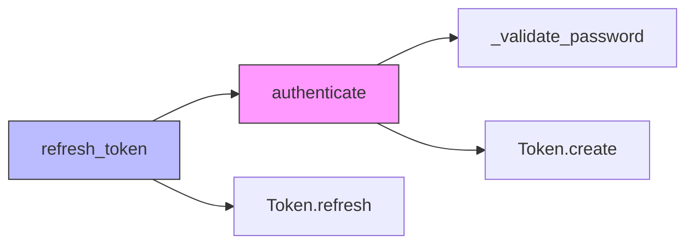
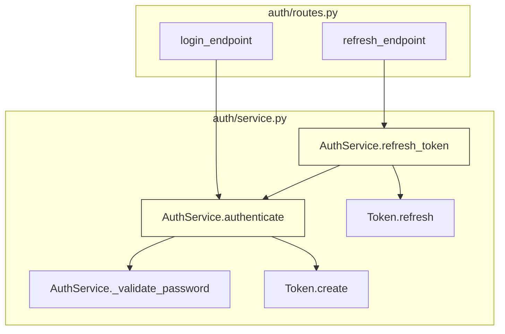

# claude-mem-lite — Architecture Specification

## Vision

A lightweight, Python-native memory system for Claude Code that tracks what happened, what changed, and what was learned — without the complexity overhead of the original claude-mem.

**Core principle**: Give Claude just enough context to be effective, with the ability to drill deeper on demand. Don't store everything — store what matters.

---

## Design Decisions & Rationale

### Language: Python

| Factor | Assessment |
|--------|-----------|
| LanceDB bindings | First-class Python SDK, Pydantic schemas, native hybrid search |
| AST parsing | `ast` stdlib = zero deps for Python files, tree-sitter for others later |
| Claude API | `anthropic` SDK works identically from Python |
| Developer fit | Primary language of the maintainer |
| Performance risk | None — bottlenecks are AI API calls (~1-3s) and embeddings (~80-150ms with Qwen3-0.6B on CPU), not the glue language |

### Storage: SQLite + LanceDB (dual-store)

**SQLite** handles structured data: sessions, queue, metadata, function maps, learnings.

- **Hooks** (synchronous scripts): use stdlib `sqlite3` directly — fast, zero deps, no async overhead for scripts that run and exit.
- **Worker** (FastAPI async server): use `aiosqlite` — async wrapper around `sqlite3` via a dedicated background thread. Prevents blocking the event loop during concurrent operations (e.g., search query arrives while compression result is being stored).

SQLite queries complete in 0.1–5ms on local SSD with WAL mode. At our load (~5 req/sec, single user), event loop blocking is rarely an issue. But `aiosqlite` provides the safety valve for free — one tiny pure-Python dependency (~500 lines), actively maintained (v0.22.1, Dec 2025), mirrors the `sqlite3` API exactly.

**Rejected alternatives**: SQLAlchemy async (pulls in SQLAlchemy + greenlet — overkill without ORM), `aiosqlitepool` (connection pooling for 30+ qps — not our scale), raw `asyncio.to_thread()` (works but less ergonomic than aiosqlite's native API).

**LanceDB** (embedded, Rust core) handles search: hybrid vector+FTS via Tantivy, with RRF reranking.

This replaces claude-mem's triple-store (SQLite + FTS5 + ChromaDB) with a cleaner split. SQLite does what it's good at (relations, transactions, exact lookups). LanceDB does what it's good at (fuzzy search, semantic similarity).

### Schema Migrations: PRAGMA user_version

SQLite's built-in `user_version` pragma tracks schema version as an integer. Sequential migrations live in code:

```python
MIGRATIONS = [
    "CREATE TABLE sessions (...);",           # v0→v1
    "ALTER TABLE observations ADD COLUMN embedding_status TEXT DEFAULT 'pending';",  # v1→v2
]

def migrate(conn):
    current = conn.execute("PRAGMA user_version").fetchone()[0]
    for i, sql in enumerate(MIGRATIONS[current:], start=current):
        conn.executescript(sql)
        conn.execute(f"PRAGMA user_version = {i + 1}")
```

**Why not Alembic**: Designed for SQLAlchemy ORM multi-developer projects. We use raw `sqlite3`, have one developer, and will have maybe 5–10 lifetime migrations. claude-mem's inline migrations (now at migration 17+) have been a source of bugs — we keep it simpler.

**Why not yoyo-migrations**: Adds a dependency for something achievable in ~30 lines. If migration complexity grows beyond 15 migrations, revisit.

### Embeddings: Qwen3-Embedding-0.6B (local)

Model: `Qwen/Qwen3-Embedding-0.6B` (600M params, ~1.2GB FP16)

**Why this model** (validated against MTEB-Code leaderboard, Feb 2025):
- **#2 sub-1B on MTEB-Code** (avg 75.0) — only 0.5 points behind the code-specialist C2LLM-0.5B (74.5), while being dramatically better at mixed NL+code content (AppsRetrieval: 75.3 vs 61.0)
- **59% better than all-MiniLM-L6-v2** on code benchmarks (75.0 vs 47.2 avg)
- **Instruction-aware**: full NL task descriptions per query type, not just "search_query:" prefix
- **Matryoshka dimensions**: 1024 → 512 → 256 → 128 → 64 → 32 (use 256d for storage/speed balance)
- **32K context window**: never truncates observations or code blocks
- **Decoder architecture** (Qwen3 backbone): ~80-150ms per embedding on CPU (acceptable — PostToolUse hook already does 100-300ms API calls for compression)

**Rejected alternatives**:
- `all-MiniLM-L6-v2`: 2019 architecture, 256-token limit, 47.2 avg on code — showing its age
- `C2LLM-0.5B`: higher on pure code retrieval (96.3 on CodeSearchNet) but code-only — poor on NL queries (61.0 on Apps). Our observations are ~80% natural language
- `gte-modernbert-base` (ModernBERT): faster on CPU (15-25ms) but 4 points lower on code (71.1 vs 75.0). Encoder architecture advantage doesn't justify quality gap
- `BGE-M3`: overkill at 568M params, multi-functionality (sparse+multi-vector) we don't need

**Configuration**:
```python
# Instruction prefixes per query type
INSTRUCTIONS = {
    "observation": "Instruct: Find development observations about code changes and decisions\nQuery: ",
    "code": "Instruct: Find code snippets, functions, and implementation details\nQuery: ",
    "learning": "Instruct: Find project learnings, patterns, and best practices\nQuery: ",
    "document": "",  # raw content for indexing
}
```

**Integration**: sentence-transformers compatible, LanceDB native via `get_registry().get("sentence-transformers")`

### AST: Python `ast` stdlib + basic call graph

Call graph tracking IS feasible. Here's the honest breakdown:

| What we can extract | Accuracy | Difficulty |
|---|---|---|
| Function/class definitions, signatures, line ranges | ~100% | Trivial |
| Direct function calls: `foo()`, `bar.baz()` | ~95% | Easy |
| `self.method()` calls (same class) | ~90% | Easy |
| Imported function calls | ~80% | Medium (need import resolution) |
| Calls via variables: `x = foo; x()` | ~30% | Hard (need type inference) |
| Dynamic calls: `getattr()`, `**kwargs` dispatch | ~0% | Not worth it |

**For our use case, 80% accuracy is excellent.** Claude doesn't need a perfect call graph — it needs a useful map. "This function probably calls these other functions" is immensely valuable, even with some false negatives. We can always mark uncertain edges.

### No Web UI

Terminal reports via `rich` + markdown file export. The original claude-mem's React+SSE viewer is ~30% of the codebase for a feature most devs never open.

---

## Architecture Overview

```
┌─────────────────────────────────────────────────────────┐
│                   Claude Code IDE                        │
│                                                          │
│  hooks.json ──► context.py   (SessionStart)              │
│              ──► capture.py   (PostToolUse)               │
│              ──► summary.py   (Stop)                      │
│              ──► cleanup.py   (SessionEnd)                │
│                     │                                     │
│                     ├─► SQLite direct (fast ops, <5ms)    │
│                     │   capture.py writes pending_queue   │
│                     │   cleanup.py marks session closed   │
│                     │                                     │
│                     └─► HTTP over UDS (AI ops, ~100-300ms)│
│                         context.py  → GET /api/context    │
│                         summary.py  → POST /api/summarize │
├─────────────────────────────────────────────────────────┤
│              Worker Service (FastAPI/uvicorn)             │
│              UDS: ~/.claude-mem/worker.sock               │
│              Daemon with PID file, 30min idle timeout     │
│                                                          │
│  ┌──────────┐  ┌──────────┐  ┌──────────────────┐       │
│  │Compressor│  │AST Tracker│  │ Learnings Engine │       │
│  │(Claude   │  │(ast stdlib│  │ (pattern detect, │       │
│  │ API raw) │  │ + calls)  │  │  confidence wt)  │       │
│  └────┬─────┘  └─────┬────┘  └────────┬─────────┘       │
│       │              │                │                  │
│       ▼              ▼                ▼                  │
│  ┌─────────────────────────────────────────────────┐     │
│  │            Storage Layer                         │     │
│  │                                                  │     │
│  │  SQLite/aiosqlite         LanceDB (search)      │     │
│  │  (structured)             (hybrid vector+FTS)    │     │
│  │  ├─ sessions              ├─ observations_vec    │     │
│  │  ├─ observations          ├─ summaries_vec       │     │
│  │  ├─ function_map          └─ learnings_vec       │     │
│  │  ├─ call_graph                                   │     │
│  │  ├─ learnings                                    │     │
│  │  ├─ pending_queue                                │     │
│  │  └─ event_log                                    │     │
│  └─────────────────────────────────────────────────┘     │
│                                                          │
│  ┌──────────────────────────────────────────────────┐    │
│  │          Logging / Eval Layer                     │    │
│  │  structured JSON logs → ~/.claude-mem/logs/       │    │
│  │  perf metrics, token counts, search quality       │    │
│  └──────────────────────────────────────────────────┘    │
└─────────────────────────────────────────────────────────┘
```

---

## Data Model

### SQLite Schema

```sql
-- ============================================================
-- SESSIONS
-- ============================================================
CREATE TABLE sessions (
    id              TEXT PRIMARY KEY,        -- uuid
    project_path    TEXT NOT NULL,
    started_at      TEXT NOT NULL,           -- ISO 8601
    ended_at        TEXT,
    status          TEXT DEFAULT 'active',   -- active | summarized | closed
    summary_text    TEXT,                    -- AI-generated session summary
    tokens_injected INTEGER DEFAULT 0,      -- track context cost
    tokens_compressed INTEGER DEFAULT 0     -- track compression savings
);

-- ============================================================
-- OBSERVATIONS (compressed tool outputs)
-- ============================================================
CREATE TABLE observations (
    id              TEXT PRIMARY KEY,
    session_id      TEXT NOT NULL REFERENCES sessions(id),
    created_at      TEXT NOT NULL,
    hook_type       TEXT NOT NULL,           -- PostToolUse | UserPrompt
    tool_name       TEXT,                    -- Write | Edit | Bash | etc.
    
    -- Progressive disclosure: lightweight → detailed
    title           TEXT NOT NULL,           -- ~10 tokens: "Added JWT auth middleware"
    summary         TEXT NOT NULL,           -- ~50 tokens: what happened + why
    detail          TEXT,                    -- ~200 tokens: full compressed observation
    
    -- Structured metadata
    files_touched   TEXT,                    -- JSON array of file paths
    functions_changed TEXT,                  -- JSON array: [{file, name, action}]
    
    -- Raw stats for eval
    raw_size_bytes  INTEGER,                -- original tool output size
    compressed_tokens INTEGER,              -- tokens after compression
    compression_time_ms INTEGER,            -- how long AI compression took
    
    FOREIGN KEY (session_id) REFERENCES sessions(id)
);

-- ============================================================
-- FUNCTION MAP (AST-extracted, per-file snapshots)
-- ============================================================
CREATE TABLE function_map (
    id              INTEGER PRIMARY KEY AUTOINCREMENT,
    file_path       TEXT NOT NULL,
    snapshot_at     TEXT NOT NULL,           -- ISO 8601
    session_id      TEXT NOT NULL,
    
    -- Function identity
    qualified_name  TEXT NOT NULL,           -- "auth.service.AuthService.authenticate"
    kind            TEXT NOT NULL,           -- function | method | async_function | async_method | class
    parent_class    TEXT,                    -- null for module-level functions
    
    -- Signature (what Claude needs to understand the function without reading it)
    signature       TEXT NOT NULL,           -- "authenticate(self, email: str, password: str) -> Token"
    decorators      TEXT,                    -- JSON array: ["@router.post('/login')", "@require_auth"]
    docstring       TEXT,                    -- first line only, for brevity
    line_start      INTEGER NOT NULL,
    line_end        INTEGER NOT NULL,
    
    -- Change tracking
    body_hash       TEXT NOT NULL,           -- md5 of ast.dump(node) — detects actual logic changes
    prev_hash       TEXT,                    -- previous body_hash, null if new
    change_type     TEXT,                    -- new | modified | unchanged | deleted
    
    UNIQUE(file_path, qualified_name, snapshot_at)
);

CREATE INDEX idx_fn_file ON function_map(file_path);
CREATE INDEX idx_fn_session ON function_map(session_id);
CREATE INDEX idx_fn_change ON function_map(change_type) WHERE change_type != 'unchanged';

-- ============================================================
-- CALL GRAPH (which function calls which — best-effort)
-- ============================================================
CREATE TABLE call_graph (
    id              INTEGER PRIMARY KEY AUTOINCREMENT,
    session_id      TEXT NOT NULL,
    snapshot_at     TEXT NOT NULL,
    
    -- Caller
    caller_file     TEXT NOT NULL,
    caller_name     TEXT NOT NULL,           -- qualified name
    
    -- Callee (what's being called)
    callee_name     TEXT NOT NULL,           -- as seen in code: "self.validate()", "db.query()"
    callee_resolved TEXT,                    -- our best guess: "AuthService.validate" or null if unknown
    
    -- Confidence
    resolution      TEXT NOT NULL,           -- direct | self_method | import | unresolved
    line_number     INTEGER,
    
    FOREIGN KEY (session_id) REFERENCES sessions(id)
);

CREATE INDEX idx_cg_caller ON call_graph(caller_file, caller_name);
CREATE INDEX idx_cg_callee ON call_graph(callee_resolved) WHERE callee_resolved IS NOT NULL;

-- ============================================================
-- LEARNINGS (distilled project knowledge, evolves over time)
-- ============================================================
CREATE TABLE learnings (
    id              INTEGER PRIMARY KEY AUTOINCREMENT,
    created_at      TEXT NOT NULL,
    updated_at      TEXT NOT NULL,
    
    category        TEXT NOT NULL,           -- architecture | convention | gotcha | dependency | pattern
    content         TEXT NOT NULL,           -- "Auth uses JWT with HttpOnly cookies, refresh in auth/refresh.py"
    confidence      REAL DEFAULT 1.0,        -- increases when seen across sessions
    times_seen      INTEGER DEFAULT 1,       -- how many sessions referenced this
    source_sessions TEXT,                    -- JSON array of session IDs that contributed
    
    is_manual       BOOLEAN DEFAULT FALSE,   -- user explicitly added/edited
    is_active       BOOLEAN DEFAULT TRUE     -- soft delete
);

-- ============================================================
-- PENDING QUEUE (crash-safe async processing)
-- ============================================================
CREATE TABLE pending_queue (
    id              INTEGER PRIMARY KEY AUTOINCREMENT,
    created_at      TEXT NOT NULL,
    session_id      TEXT NOT NULL,
    hook_type       TEXT NOT NULL,
    payload         TEXT NOT NULL,           -- JSON: raw tool output + metadata
    status          TEXT DEFAULT 'pending',  -- pending | processing | done | failed
    attempts        INTEGER DEFAULT 0,
    error           TEXT                     -- last error if failed
);

-- ============================================================
-- EVENT LOG (extensive logging for eval)
-- ============================================================
CREATE TABLE event_log (
    id              INTEGER PRIMARY KEY AUTOINCREMENT,
    timestamp       TEXT NOT NULL,
    session_id      TEXT,
    event_type      TEXT NOT NULL,           -- see Event Types below
    
    -- Flexible payload
    data            TEXT NOT NULL,           -- JSON
    
    -- Performance
    duration_ms     INTEGER,
    tokens_in       INTEGER,
    tokens_out      INTEGER
);

CREATE INDEX idx_log_session ON event_log(session_id);
CREATE INDEX idx_log_type ON event_log(event_type);
CREATE INDEX idx_log_time ON event_log(timestamp);
```

### Event Log Types (for eval)

```
hook.context_inject      — what was injected, token count, latency
hook.capture             — raw size, tool name, file paths
hook.summary             — session summary generated
compress.start           — observation compression started
compress.done            — compression result: ratio, tokens, latency
compress.error           — compression failed
ast.scan                 — file scanned, functions found, changes detected
ast.call_graph           — call graph extracted, edges found, unresolved count
search.query             — search query, type (hybrid/fts/vector), latency, result count
search.result            — what was returned, relevance assessment
learning.extracted       — new learning identified
learning.reinforced      — existing learning seen again (confidence++)
learning.invalidated     — learning contradicted by new evidence
context.token_budget     — tokens available vs used vs remaining
context.progressive      — which disclosure level was used (index/summary/detail)
```

### LanceDB Tables

```python
from lancedb.pydantic import LanceModel, Vector
from lancedb.embeddings import get_registry

# Qwen3-Embedding-0.6B at 256d (Matryoshka) for storage/speed balance
embed_fn = get_registry().get("sentence-transformers").create(
    name="Qwen/Qwen3-Embedding-0.6B",
    truncate_dim=256  # Matryoshka: 1024→512→256→128→64→32
)

class ObservationIndex(LanceModel):
    """Searchable observation summaries"""
    observation_id: str                              # FK to SQLite
    session_id: str
    title: str = embed_fn.SourceField()              # embedded for search
    summary: str                                     # included in results
    files_touched: str                               # comma-separated paths
    functions_changed: str                           # comma-separated names
    created_at: str
    vector: Vector(256) = embed_fn.VectorField()

class SummaryIndex(LanceModel):
    """Searchable session summaries"""
    session_id: str
    summary_text: str = embed_fn.SourceField()
    project_path: str
    created_at: str
    vector: Vector(256) = embed_fn.VectorField()

class LearningIndex(LanceModel):
    """Searchable project learnings"""
    learning_id: int                                 # FK to SQLite
    content: str = embed_fn.SourceField()
    category: str
    confidence: float
    vector: Vector(256) = embed_fn.VectorField()
```

---

## AST Tracker — Detailed Design

### What it captures

For every Python file touched during a session, the AST tracker produces:

**1. Function Map** — the lightweight overview Claude sees first:

```
auth/service.py:
  class AuthService:
    authenticate(self, email: str, password: str) -> Token  [L12-L45] @router.post MODIFIED
    refresh_token(self, token: str) -> Token                [L47-L62] @require_auth NEW
    _validate_password(self, plain: str, hashed: str) -> bool [L64-L71] UNCHANGED
  
  create_auth_service() -> AuthService                       [L73-L78] UNCHANGED
```

This is ~150 tokens for an entire file. Claude can decide if it needs to read the actual code.

**2. Call Graph** — who calls who (best-effort):

```
AuthService.authenticate:
  ├── self._validate_password()    [resolved: AuthService._validate_password]
  ├── Token.create()               [resolved: models.token.Token.create]  
  ├── db.query()                   [unresolved: db is injected dependency]
  └── logger.info()                [resolved: stdlib, ignored]

AuthService.refresh_token:
  ├── self.authenticate()          [resolved: AuthService.authenticate]
  └── Token.refresh()              [resolved: models.token.Token.refresh]
```

**3. Mermaid output** — for the report command:



### How extraction works

```python
import ast
import hashlib
from dataclasses import dataclass, field

@dataclass
class FunctionInfo:
    qualified_name: str
    kind: str                    # function | method | async_function | class
    parent_class: str | None
    signature: str
    decorators: list[str]
    docstring: str | None
    line_start: int
    line_end: int
    body_hash: str
    calls: list["CallInfo"] = field(default_factory=list)

@dataclass
class CallInfo:
    callee_name: str             # as written: "self.validate()", "db.query()"
    callee_resolved: str | None  # best guess: "AuthService.validate"
    resolution: str              # direct | self_method | import | unresolved
    line_number: int

class FunctionExtractor(ast.NodeVisitor):
    """Extract functions, signatures, and call graphs from Python source."""
    
    def __init__(self, source: str, file_path: str, import_map: dict[str, str] = None):
        self.source = source
        self.file_path = file_path
        self.import_map = import_map or {}
        self.functions: list[FunctionInfo] = []
        self._context_stack: list[str] = []  # tracks nesting: [module, class, function]
        self._current_class: str | None = None
    
    def extract(self) -> list[FunctionInfo]:
        tree = ast.parse(self.source)
        self._extract_imports(tree)
        self.visit(tree)
        return self.functions
    
    def _extract_imports(self, tree: ast.Module):
        """Build import map: local_name -> module.qualified.name"""
        for node in ast.walk(tree):
            if isinstance(node, ast.Import):
                for alias in node.names:
                    name = alias.asname or alias.name
                    self.import_map[name] = alias.name
            elif isinstance(node, ast.ImportFrom):
                module = node.module or ""
                for alias in node.names:
                    name = alias.asname or alias.name
                    self.import_map[name] = f"{module}.{alias.name}"
    
    def visit_ClassDef(self, node: ast.ClassDef):
        prev_class = self._current_class
        self._current_class = node.name
        self._context_stack.append(node.name)
        self.generic_visit(node)
        self._context_stack.pop()
        self._current_class = prev_class
    
    def visit_FunctionDef(self, node: ast.FunctionDef):
        self._process_function(node, is_async=False)
    
    def visit_AsyncFunctionDef(self, node: ast.AsyncFunctionDef):
        self._process_function(node, is_async=True)
    
    def _process_function(self, node, is_async: bool):
        # Build qualified name
        parts = self._context_stack + [node.name]
        qualified = ".".join(parts)
        
        # Determine kind
        if self._current_class:
            kind = "async_method" if is_async else "method"
        else:
            kind = "async_function" if is_async else "function"
        
        # Extract signature
        sig = self._build_signature(node)
        
        # Extract decorators
        decorators = []
        for d in node.decorator_list:
            decorators.append(ast.unparse(d))
        
        # Docstring (first line only)
        docstring = ast.get_docstring(node)
        if docstring:
            docstring = docstring.split("\n")[0].strip()
        
        # Body hash for change detection
        body_hash = hashlib.md5(ast.dump(node).encode()).hexdigest()[:12]
        
        # Extract calls within this function
        calls = self._extract_calls(node)
        
        info = FunctionInfo(
            qualified_name=qualified,
            kind=kind,
            parent_class=self._current_class,
            signature=sig,
            decorators=decorators,
            docstring=docstring,
            line_start=node.lineno,
            line_end=node.end_lineno or node.lineno,
            body_hash=body_hash,
            calls=calls,
        )
        self.functions.append(info)
        
        # Visit nested functions/classes
        self._context_stack.append(node.name)
        self.generic_visit(node)
        self._context_stack.pop()
    
    def _build_signature(self, node) -> str:
        """Build readable signature: 'name(arg: type, ...) -> return_type'"""
        args_parts = []
        args = node.args
        
        # Positional args
        defaults_offset = len(args.args) - len(args.defaults)
        for i, arg in enumerate(args.args):
            part = arg.arg
            if arg.annotation:
                part += f": {ast.unparse(arg.annotation)}"
            if i >= defaults_offset:
                default = args.defaults[i - defaults_offset]
                part += f" = {ast.unparse(default)}"
            args_parts.append(part)
        
        # *args, **kwargs
        if args.vararg:
            part = f"*{args.vararg.arg}"
            if args.vararg.annotation:
                part += f": {ast.unparse(args.vararg.annotation)}"
            args_parts.append(part)
        if args.kwarg:
            part = f"**{args.kwarg.arg}"
            if args.kwarg.annotation:
                part += f": {ast.unparse(args.kwarg.annotation)}"
            args_parts.append(part)
        
        sig = f"{node.name}({', '.join(args_parts)})"
        if node.returns:
            sig += f" -> {ast.unparse(node.returns)}"
        return sig
    
    def _extract_calls(self, func_node) -> list[CallInfo]:
        """Extract all function calls within a function body."""
        calls = []
        for node in ast.walk(func_node):
            if not isinstance(node, ast.Call):
                continue
            
            callee_name, resolved, resolution = self._resolve_call(node)
            
            # Skip noise: builtins, stdlib logging, print, etc.
            if callee_name in ("print", "len", "range", "enumerate", "zip",
                               "isinstance", "hasattr", "getattr", "setattr",
                               "super", "type", "str", "int", "float", "bool",
                               "list", "dict", "set", "tuple"):
                continue
            
            calls.append(CallInfo(
                callee_name=callee_name,
                callee_resolved=resolved,
                resolution=resolution,
                line_number=getattr(node, "lineno", 0),
            ))
        return calls
    
    def _resolve_call(self, node: ast.Call) -> tuple[str, str | None, str]:
        """
        Resolve a call node to (raw_name, qualified_name, resolution_type).
        
        Returns best-effort resolution:
        - direct: simple name call, resolved via imports or local scope
        - self_method: self.method() → ClassName.method
        - import: resolved via import map
        - unresolved: couldn't determine target
        """
        func = node.func
        
        # Simple call: foo()
        if isinstance(func, ast.Name):
            name = func.id
            if name in self.import_map:
                return name, self.import_map[name], "import"
            return name, name, "direct"
        
        # Attribute call: x.foo()
        if isinstance(func, ast.Attribute):
            method = func.attr
            
            # self.method() → resolve to current class
            if isinstance(func.value, ast.Name) and func.value.id == "self":
                resolved = f"{self._current_class}.{method}" if self._current_class else None
                return f"self.{method}()", resolved, "self_method"
            
            # cls.method() or ClassName.method()
            if isinstance(func.value, ast.Name):
                obj_name = func.value.id
                raw = f"{obj_name}.{method}()"
                
                # Check if obj_name is an imported module/class
                if obj_name in self.import_map:
                    return raw, f"{self.import_map[obj_name]}.{method}", "import"
                
                return raw, f"{obj_name}.{method}", "direct"
            
            # Chained: a.b.method() — just record as-is
            try:
                raw = ast.unparse(func) + "()"
            except Exception:
                raw = f"?.{method}()"
            return raw, None, "unresolved"
        
        # Anything else (lambdas, subscripts, etc.)
        try:
            raw = ast.unparse(func) + "()"
        except Exception:
            raw = "<dynamic>()"
        return raw, None, "unresolved"
```

### Change Detection Flow

```
PostToolUse hook fires (file was written/edited)
    │
    â–¼
AST tracker receives file path
    │
    ├── Parse file with ast.parse()
    │   (if SyntaxError: log warning, skip — file might be mid-edit)
    │
    ├── Extract functions + calls via FunctionExtractor
    │
    ├── Load previous snapshot from function_map (same file, most recent)
    │
    ├── Compare by qualified_name:
    │   ├── In new, not in old → change_type = "new"
    │   ├── In old, not in new → change_type = "deleted"  
    │   ├── body_hash differs → change_type = "modified"
    │   └── body_hash same   → change_type = "unchanged"
    │
    ├── Store new snapshot in function_map + call_graph
    │
    └── Log event: ast.scan with stats
```

---

## Context Injection — Progressive Disclosure

When a new session starts, the context hook builds a prompt injection that respects a token budget (default: 2000 tokens).

### Injection layers (priority order):

**Layer 1: Session index (~200 tokens)**
```
## Recent Sessions
- [2h ago] Implemented JWT auth service, added refresh token endpoint, wrote tests (commit abc123)
- [yesterday] Set up FastAPI project structure, configured SQLAlchemy + Alembic
- [2 days ago] Initial project scaffold, Docker setup
```

**Layer 2: Function map of recently changed files (~300 tokens)**
```
## Recently Changed Code
auth/service.py (modified 2h ago):
  class AuthService:
    authenticate(email, password) -> Token  MODIFIED
    refresh_token(token) -> Token           NEW
    _validate_password(plain, hashed) -> bool  UNCHANGED
```

**Layer 3: Active learnings (~200 tokens)**
```
## Project Knowledge
- Architecture: FastAPI + SQLAlchemy ORM, Alembic migrations, pytest fixtures
- Convention: JWT tokens in HttpOnly cookies, refresh flow in auth/refresh.py  
- Gotcha: user_service.get_by_email() returns None on DB errors — always check
```

**Layer 4: Relevant observations (~300 tokens, if budget allows)**
Semantic search for observations related to files currently open or recently discussed.

**Layer 5: Call graph context (~200 tokens, on demand)**
Only injected if Claude asks "what calls this function" or similar.

### Token budget allocation:

```python
BUDGET = 2000  # configurable

ALLOCATION = {
    "session_index": 300,    # always included
    "function_map": 500,     # recently changed files
    "learnings": 300,        # active project knowledge
    "observations": 600,     # relevant past observations
    "call_graph": 300,       # on-demand via search
}
```

The search skill allows Claude to request deeper information at any time, which pulls from LanceDB with hybrid search.

---

## Learnings Engine

### How learnings are extracted

After each session summary, the compressor analyzes the summary + observations to extract potential learnings. The prompt:

```
Given this session summary and observations, extract any reusable project knowledge.
Categories: architecture, convention, gotcha, dependency, pattern

Only extract things that would be useful across multiple sessions.
Do NOT extract session-specific actions ("fixed bug X") — those are observations.
DO extract patterns ("this codebase uses X pattern for Y").

Return JSON array:
[{"category": "...", "content": "...", "confidence": 0.0-1.0}]
```

### Confidence evolution

```
New learning extracted (confidence: 0.5)
    │
    ├── Seen in 2nd session → confidence: 0.7
    ├── Seen in 3rd session → confidence: 0.85  
    ├── Seen in 5th session → confidence: 0.95
    │
    ├── Contradicted by new evidence → confidence: max(0.1, current - 0.3)
    │
    └── Manually confirmed by user → confidence: 1.0, is_manual: true
```

### Deduplication

Before adding a new learning, semantic search against existing learnings (cosine similarity > 0.85). If match found:
- If same meaning: increment `times_seen`, update `confidence`, append session to `source_sessions`
- If contradictory: flag for review, log `learning.invalidated` event

---

## Logging Strategy

### Philosophy

**Log everything structured. Analyze later.** Don't try to decide upfront what's useful — that's what eval is for.

### Implementation

```python
import json
import time
import logging
from contextlib import contextmanager
from pathlib import Path

class MemLogger:
    """Structured logger that writes to both file and SQLite event_log."""
    
    def __init__(self, db, log_dir: Path):
        self.db = db
        self.log_dir = log_dir
        self.log_dir.mkdir(parents=True, exist_ok=True)
        
        # Rotating daily JSON log files
        self._file_logger = logging.getLogger("claude-mem-lite")
        handler = logging.handlers.TimedRotatingFileHandler(
            log_dir / "events.jsonl", when="midnight", backupCount=30
        )
        handler.setFormatter(logging.Formatter("%(message)s"))
        self._file_logger.addHandler(handler)
        self._file_logger.setLevel(logging.DEBUG)
    
    def log(self, event_type: str, data: dict, 
            session_id: str = None, duration_ms: int = None,
            tokens_in: int = None, tokens_out: int = None):
        """Log a structured event to both file and database."""
        entry = {
            "timestamp": datetime.utcnow().isoformat(),
            "event_type": event_type,
            "session_id": session_id,
            "data": data,
            "duration_ms": duration_ms,
            "tokens_in": tokens_in,
            "tokens_out": tokens_out,
        }
        
        # File (always, fast)
        self._file_logger.info(json.dumps(entry, default=str))
        
        # SQLite (best effort, don't block on failure)
        try:
            self.db.execute(
                "INSERT INTO event_log (timestamp, session_id, event_type, data, duration_ms, tokens_in, tokens_out) "
                "VALUES (?, ?, ?, ?, ?, ?, ?)",
                (entry["timestamp"], session_id, event_type, 
                 json.dumps(data, default=str), duration_ms, tokens_in, tokens_out)
            )
        except Exception:
            pass  # file log is the source of truth
    
    @contextmanager
    def timed(self, event_type: str, session_id: str = None, **extra):
        """Context manager that logs duration automatically."""
        start = time.perf_counter()
        result = {"status": "started", **extra}
        try:
            yield result
            result["status"] = "success"
        except Exception as e:
            result["status"] = "error"
            result["error"] = str(e)
            raise
        finally:
            duration = int((time.perf_counter() - start) * 1000)
            self.log(event_type, result, session_id=session_id, duration_ms=duration)
```

### Usage patterns

```python
# Compression timing
with logger.timed("compress.done", session_id=sid, raw_size=len(raw)):
    compressed = await compressor.compress(raw_output)
    result["compressed_tokens"] = compressed.token_count
    result["ratio"] = len(raw) / compressed.token_count

# Search quality tracking
logger.log("search.query", {
    "query": query,
    "type": "hybrid",
    "result_count": len(results),
    "top_score": results[0].score if results else None,
}, session_id=sid, duration_ms=elapsed)

# AST tracking
logger.log("ast.scan", {
    "file": file_path,
    "functions_found": len(functions),
    "new": count_new,
    "modified": count_modified,
    "deleted": count_deleted,
    "call_edges": total_edges,
    "unresolved_calls": unresolved_count,
}, session_id=sid, duration_ms=elapsed)
```

### Eval queries (run from CLI)

```sql
-- Compression efficiency over time
SELECT date(timestamp) as day,
       AVG(json_extract(data, '$.ratio')) as avg_ratio,
       AVG(duration_ms) as avg_compress_ms
FROM event_log WHERE event_type = 'compress.done'
GROUP BY day ORDER BY day;

-- Search quality: are results being used?
SELECT event_type, COUNT(*) as count,
       AVG(duration_ms) as avg_ms
FROM event_log WHERE event_type LIKE 'search.%'
GROUP BY event_type;

-- AST resolution accuracy
SELECT json_extract(data, '$.file') as file,
       json_extract(data, '$.call_edges') as edges,
       json_extract(data, '$.unresolved_calls') as unresolved,
       ROUND(1.0 - CAST(json_extract(data, '$.unresolved_calls') AS REAL) / 
             MAX(json_extract(data, '$.call_edges'), 1), 2) as resolution_rate
FROM event_log WHERE event_type = 'ast.scan'
ORDER BY timestamp DESC LIMIT 20;

-- Token budget usage
SELECT json_extract(data, '$.total_tokens') as injected,
       json_extract(data, '$.budget') as budget,
       json_extract(data, '$.layers_included') as layers
FROM event_log WHERE event_type = 'context.token_budget'
ORDER BY timestamp DESC LIMIT 10;

-- Learning evolution
SELECT content, confidence, times_seen, updated_at
FROM learnings WHERE is_active = 1
ORDER BY confidence DESC;
```

---

## Report Command (CLI)

### `claude-mem report` — generates a session report

Output: terminal (rich) + optional markdown file

```
╭─ Session Report: 2026-02-07 ──────────────────────────────────╮
│                                                                 │
│  Sessions today: 3                                              │
│  Observations captured: 47                                      │
│  Functions changed: 12 new, 8 modified, 2 deleted               │
│  Compression ratio: 42:1 avg (87ms avg)                         │
│                                                                 │
│  ── Latest Session ──                                           │
│  Implemented JWT auth with refresh tokens.                      │
│  Files: auth/service.py, auth/routes.py, tests/test_auth.py     │
│                                                                 │
│  ── Function Changes ──                                         │
│  NEW    AuthService.refresh_token(token) -> Token               │
│  MOD    AuthService.authenticate(email, password) -> Token      │
│  NEW    test_refresh_token_flow()                                │
│                                                                 │
│  ── Call Graph (auth/service.py) ──                              │
│                                                                  │
│  authenticate ──► _validate_password                             │
│       │                                                          │
│       └──► Token.create                                          │
│                                                                  │
│  refresh_token ──► authenticate                                  │
│       │                                                          │
│       └──► Token.refresh                                         │
│                                                                  │
│  ── Active Learnings (top 5) ──                                  │
│  [0.95] Architecture: FastAPI + SQLAlchemy, Alembic migrations   │
│  [0.85] Convention: JWT in HttpOnly cookies                      │
│  [0.70] Pattern: All services use dependency injection via       │
│         FastAPI Depends()                                        │
│                                                                  │
╰──────────────────────────────────────────────────────────────────╯
```

### `claude-mem report --mermaid` — outputs call graph as mermaid



### `claude-mem report --eval` — performance dashboard

```
╭─ Performance Eval ──────────────────────────────────────────────╮
│                                                                  │
│  Period: Last 7 days                                             │
│                                                                  │
│  Compression    avg ratio: 38:1  avg latency: 92ms              │
│  Context inject avg tokens: 1,847  budget: 2,000                │
│  Search         avg latency: 12ms  avg results: 4.2             │
│  AST resolution rate: 82%  (unresolved: mostly injected deps)   │
│                                                                  │
│  Token costs:                                                    │
│    Compression API calls: 312                                    │
│    ~Est. tokens consumed: 156K input + 31K output                │
│    ~Est. cost at Haiku: $0.05                                    │
│                                                                  │
│  Learnings: 23 active (8 high-confidence, 3 manual)              │
│                                                                  │
│  Top unresolved calls (candidates for type hints):               │
│    db.query()     — seen 47 times across 12 functions            │
│    cache.get()    — seen 23 times across 8 functions             │
│    client.post()  — seen 15 times across 5 functions             │
│                                                                  │
╰──────────────────────────────────────────────────────────────────╯
```

---

## Directory Structure

```
claude-mem-lite/
├── src/
│   └── claude_mem_lite/
│       ├── __init__.py
│       ├── config.py               # Settings, paths, defaults
│       │
│       ├── hooks/                   # Claude Code lifecycle hooks
│       │   ├── __init__.py
│       │   ├── context.py           # SessionStart → inject context
│       │   ├── capture.py           # PostToolUse → capture + queue
│       │   ├── summary.py           # Stop → generate summary
│       │   └── cleanup.py           # SessionEnd → finalize
│       │
│       ├── worker/                  # Background processing
│       │   ├── __init__.py
│       │   ├── server.py            # FastAPI app (thin HTTP layer)
│       │   ├── processor.py         # Queue consumer, orchestrates processing
│       │   └── compressor.py        # AI compression via Claude API
│       │
│       ├── ast_tracker/             # Code intelligence
│       │   ├── __init__.py
│       │   ├── extractor.py         # FunctionExtractor (ast-based)
│       │   ├── diff.py              # Change detection (hash comparison)
│       │   ├── call_graph.py        # Call graph extraction + resolution
│       │   └── mermaid.py           # Mermaid diagram generation
│       │
│       ├── learnings/               # Project knowledge engine
│       │   ├── __init__.py
│       │   ├── engine.py            # Extraction, dedup, confidence
│       │   └── prompts.py           # Learning extraction prompts
│       │
│       ├── storage/                 # Data layer
│       │   ├── __init__.py
│       │   ├── sqlite_store.py      # SQLite operations
│       │   ├── lance_store.py       # LanceDB operations
│       │   ├── models.py            # Pydantic models
│       │   └── migrations.py        # Schema versioning
│       │
│       ├── search/                  # Retrieval
│       │   ├── __init__.py
│       │   └── hybrid.py            # Hybrid search orchestration
│       │
│       ├── context/                 # Context injection
│       │   ├── __init__.py
│       │   └── builder.py           # Progressive disclosure, token budgeting
│       │
│       ├── cli/                     # Terminal interface
│       │   ├── __init__.py
│       │   ├── report.py            # Report generation
│       │   ├── search_cmd.py        # CLI search
│       │   └── eval_cmd.py          # Performance eval dashboard
│       │
│       └── logging/
│           ├── __init__.py
│           └── logger.py            # MemLogger (structured logging)
│
├── plugin/                          # Claude Code plugin distribution
│   ├── hooks.json                   # Hook registration
│   ├── scripts/                     # Hook entry points
│   │   ├── context-hook.py
│   │   ├── capture-hook.py
│   │   ├── summary-hook.py
│   │   └── cleanup-hook.py
│   └── skills/
│       └── mem-search/
│           └── SKILL.md             # Search skill for Claude
│
├── tests/
│   ├── test_extractor.py
│   ├── test_call_graph.py
│   ├── test_compressor.py
│   ├── test_search.py
│   ├── test_learnings.py
│   └── test_context_builder.py
│
├── pyproject.toml                   # Single config: deps, build, tools
└── README.md
```

---

## Dependencies

```toml
[project]
name = "claude-mem-lite"
requires-python = ">=3.11"
dependencies = [
    "lancedb>=0.15",                # Embedded vector DB (Rust core)
    "sentence-transformers>=3.0",   # Local embeddings (Qwen3-Embedding-0.6B)
    "torch>=2.2",                   # PyTorch backend for Qwen3 decoder model
    "anthropic>=0.40",              # Claude API for compression (raw messages.create)
    "fastapi>=0.115",               # Worker HTTP server
    "uvicorn>=0.30",                # ASGI server (native UDS support)
    "httpx>=0.27",                  # Async HTTP client (native UDS support)
    "aiosqlite>=0.20",              # Async SQLite for worker event loop
    "rich>=13.0",                   # Terminal output
]

[project.optional-dependencies]
dev = [
    "pytest>=8.0",
    "pytest-asyncio>=0.24",
    "ruff>=0.8",
]
```

**Total: 9 runtime dependencies** (vs claude-mem's Node+Bun+uv+ChromaDB+Express+esbuild+React). Note: `torch` is a transitive dep of sentence-transformers but listed explicitly for Qwen3's decoder architecture. `aiosqlite` is pure Python (~500 lines). `httpx` is needed for hooks connecting to the worker via UDS.

All heavy lifting done by Rust (LanceDB) and C/C++ (SQLite, PyTorch backend for Qwen3-Embedding). Python is glue.

---

## What We're NOT Building (and why)

| Feature | Reason to skip |
|---------|---------------|
| Web UI | Report command is enough. Add later if needed. |
| Multi-provider agents | One model (Claude) for compression. Keep it simple. |
| MCP tools | Skills are lighter (~250 tokens vs ~2500 for MCP). |
| ChromaDB | LanceDB does hybrid search natively, no Python server needed. |
| TypeScript/Bun | Python is simpler for this use case, fewer moving parts. |
| Full AST diffing (GumTree) | Hash comparison catches changes. Git has the full diffs. |
| Cross-language AST | Python `ast` for .py. Add tree-sitter later if needed. |
| Real-time SSE streaming | Not needed without web UI. |
| Endless mode | Experimental in claude-mem, adds 60-90s latency. Skip. |

---

## Resolved Implementation Decisions

All open questions from the initial architecture have been resolved through research and analysis across multiple sessions.

| Question | Decision | Rationale |
|----------|----------|-----------|
| **Worker process model** | Uvicorn single-process daemon, no Gunicorn | Single user, ~5 req/s. Gunicorn is for multi-user production APIs. PID file at `~/.claude-mem/worker.pid`, 30min idle timeout, auto-start from alias. |
| **IPC: Hook→Worker** | HTTP over Unix domain socket | UDS eliminates port conflicts, uvicorn+httpx both support natively, ~1-2ms latency. PostToolUse bypasses HTTP entirely (writes directly to SQLite). Only 2-3 HTTP calls per session. |
| **Compression model** | A/B test framework, tiered approach | Randomized 50/50 split, score on 4 dimensions. Likely result: Haiku for observations, Sonnet for summaries. Data decides. |
| **Compression method** | Raw `anthropic` API calls, not Agent SDK | Claude-mem's Agent SDK approach caused memory leaks (40GB+), zombie processes, stale sessions. Simple `client.messages.create()` avoids entire class of bugs. |
| **Embedding loading** | Pre-load Qwen3-0.6B at worker startup | 3-5s cost at startup, zero cost per-request. Future: ONNX INT8 quantization (~300MB, ~2x CPU speedup). |
| **AST scanning** | Per-hook (every file touch) | `ast.parse()` is <10ms per file. Always-current function map is worth it. |
| **Search interface** | Skills for on-demand, Hooks for lifecycle | Skills: ~30 tokens cost vs MCP's ~2000+. Hooks: deterministic capture/inject. Each does what it's good at. |
| **Call graph validation** | Self-healing confidence system | Static analysis + runtime observation confirmation. Accuracy improves from ~82% to ~94% over weeks. |
| **Schema migrations** | `PRAGMA user_version` (~30 lines) | SQLite-native, zero deps. Alembic is overkill for single-developer local tool with ~10 lifetime migrations. |
| **SQLite async** | `aiosqlite` in worker, `sqlite3` in hooks | Worker needs async to not block FastAPI event loop. Hooks are synchronous scripts — no async overhead needed. |
| **Graceful degradation** | FTS fallback + store raw uncompressed | Qwen3 fails → LanceDB Tantivy FTS-only. Claude API down → `pending_queue` with `status='raw'`, catch-up on restart. |

### Worker Lifecycle

```bash
# User starts worker + Claude Code together
alias cc='claude-mem-worker start --daemon && claude'
```

Worker process management:
- **Start**: Daemon backgrounds with PID file at `~/.claude-mem/worker.pid`, socket at `~/.claude-mem/worker.sock`
- **Discovery**: Hooks check `~/.claude-mem/worker.info` for connection details
- **Idle timeout**: Worker auto-exits after 30 minutes of inactivity
- **Stop**: `claude-mem-worker stop` via PID file, or idle timeout
- **Crash recovery**: `pending_queue` in SQLite ensures nothing is lost. Next hook call can restart worker.

### Graceful Degradation Strategy

```
Qwen3 fails to load:
  → LanceDB Tantivy FTS-only search (no semantic matching)
  → Search quality degrades but doesn't break
  → Log warning, continue operating

Claude API down:
  → Observations go to pending_queue with status='raw'
  → Worker checks for raw entries on startup, compresses automatically
  → Manual catch-up: `claude-mem compress --pending`

Worker not running:
  → capture.py writes directly to SQLite (always works)
  → context.py / summary.py fail gracefully (no context injection, no summary)
  → Next session auto-starts worker
```
